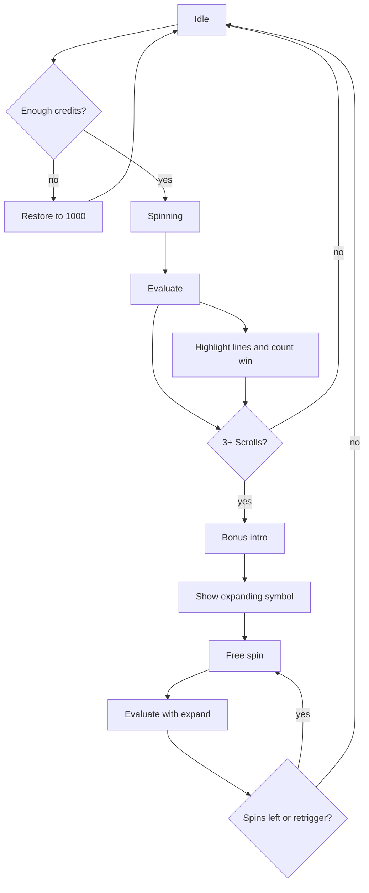

# Dragon Scroll Slot - Plan

## Goal Capsule

- **Objective:** Ship a first playable browser slot, Dragon Scroll, that a single player can spin on desktop and phone with fake credits and a complete Book of Ra-style loop.
- **Product authority:** This plan owns only that game. The existing TON raffle in `SwaTik91/shuffle` is a different product and is not in scope.
- **Open blockers:** None. Remaining choices are deferred to planning.

---

## Product Contract

### Summary

A personal Chinese-themed 5×3 video slot in a new project, with fake money, selectable lines and bet, a paytable, and the full Book of Ra feature loop: a scroll that is both wild and scatter, ten free spins, and a randomly chosen expanding symbol. The shell is one modern layout for desktop and phone. v1 feels like a machine: winning lines light up, a win counter ticks, and a short intro leads into the bonus. Implementation does not land in the shuffle raffle repository.

### Problem Frame

There is no slot to play today. The shuffle repo is a TON raffle stub, not a game. The player wants a sandbox they can open in a browser and treat like a video slot, without real payouts and without turning the raffle into a casino.

### Key Decisions

- Separate project, not shuffle. (session-settled: user-directed — chosen over replacing or extending the raffle: keep the raffle repo untouched.) Governs R16.
- Casino sandbox with fake credits. (session-settled: user-directed — chosen over a visual-only spinner and over TON/Telegram hooks in v1: playable bankroll without real money.) Governs R1, R2.
- For the author as the only first player. (session-settled: user-directed — chosen over a demo-for-friends or learn-to-make-games framing: optimize for sitting down and spinning.)
- Book of Ra mechanical template. (session-settled: user-directed — chosen over Lucky Lady’s Charm, Sizzling Hot, and generic Novomatic chrome: 10 lines, dual wild/scatter, 10 free spins, expanding symbol.) Governs R3, R6, R7, R8.
- Full feature loop in v1. (session-settled: user-directed — chosen over a base-game-first slice: first playable build already includes free spins.) Governs R6, R7, R8.
- Chinese dragons theme, own name and symbols. (session-settled: user-directed — chosen over an Egypt homage and over a neutral placeholder theme: feel Novomatic, do not clone Book of Ra art or title.) Governs R13.
- One modern layout on desktop and phone. (session-settled: user-directed — chosen over classic Novomatic cabinet chrome and over a split desktop/mobile chrome: comfort over cabinet look.) Governs R12.
- Machine-like presentation without sound or gamble. (session-settled: user-directed — chosen over a bare functional loop and over a full cabinet with audio: line highlight, win counter, bonus intro only.) Governs R9, R10, R11.
- Approach A: faithful Book of Ra rules in Chinese dress. (session-settled: user-directed — chosen over a trimmed paytable and over a China-only extra twist: learn the real loop first.) Governs R3–R8.
- Russian UI and browser-persisted balance. (session-settled: user-approved — chosen over English and over a reset-on-refresh balance: confirmed with the scoping synthesis.) Governs R14, R15.

<!-- ce-section: work-relationships -->
### How This Work Fits Together

This plan owns the Dragon Scroll browser game only. The broader picture below is the current understanding, not a committed roadmap.

- Dragon Scroll v1 (this plan)
  - Can proceed independently of the shuffle TON raffle
  - Enables later sound, gamble, and autoplay on the same game
  - Still to decide: whether a later product ever connects credits to TON or Telegram
- Shuffle raffle
  - Can proceed independently of Dragon Scroll
  - Shares nothing with this plan except the same GitHub account
- Later slot extras (sound, red/black gamble, autoplay, a China-specific extra feature)
  - Depends on Dragon Scroll v1 existing and feeling correct
  - Not requirements here

### Actors

- A1. Player — the only user. Sets lines and bet, spins, reads wins and the paytable, and continues until they stop or restore credits.

### Requirements

**Bankroll**

- R1. The player starts with 1000 fake credits and sees the current balance at all times.
- R2. A spin costs `lines × bet-per-line` credits, deducted before the reels move. If the balance is lower than that cost, Spin is disabled and the player can restore the balance to 1000.

**Machine shape**

- R3. The grid is 5 reels by 3 rows with 10 selectable paylines, default 10, changeable from 1 to 10 before a spin.
- R4. Bet per line is chosen from a small fixed set of denominations that includes at least 1, 2, 5, and 10. Total bet is visible before Spin.
- R5. Line wins pay left to right on adjacent symbols along an active line, starting from reel 1. Only the highest win on each line is paid. Scatter wins pay in any position and are added to line wins.

**Book of Ra loop**

- R6. The Scroll symbol substitutes for every symbol except itself as scatter, and three or more Scrolls anywhere start 10 free spins at the triggering lines and bet.
- R7. After the trigger and before the first free spin, the game picks one non-Scroll symbol at random and shows it as the expanding symbol for that feature.
- R8. During free spins, each reel that shows the expanding symbol expands to fill all three rows and pays on every active line that can use that reel, without needing adjacency. Three or more Scrolls during the feature add 10 more free spins and keep the same expanding symbol.

**Machine feel**

- R9. After a paying spin, every winning line is highlighted in turn or together, and a win counter shows the credits awarded for that spin before they hit the balance.
- R10. Entering free spins uses a short full-screen or overlay intro that names the feature and shows the chosen expanding symbol. The player must dismiss it or it auto-continues after a brief beat.
- R11. A paytable screen lists every symbol, line pays, scatter pays, and the free-spin rules in Russian.

**Shell**

- R12. One modern control layout serves phone and desktop: reels first, then balance, total bet, line control, bet control, Spin, and paytable access. No classic cabinet meter row.
- R13. Theme, title, and symbols are original Chinese-fantasy (dragons and related icons). The game must not use Novomatic or Book of Ra names, logos, or artwork.
- R14. All player-facing copy is Russian.
- R15. Balance, last lines, and last bet-per-line survive a browser refresh on the same device.
- R16. The game is a new project. The shuffle raffle pages stay unchanged.

### Key Flows

- F1. Paid base spin
  - **Trigger:** Player presses Spin with enough credits.
  - **Actors:** A1
  - **Steps:** Deduct total bet; reels land; evaluate lines and scatters per R5; if a win, present it per R9 and add it to balance; if R6 triggers, go to F3; else return to idle.
  - **Outcome:** Balance and last bet state are current. Covered by R1, R2, R5, R9.
- F2. Insufficient credits
  - **Trigger:** Player is idle with balance below total bet.
  - **Actors:** A1
  - **Steps:** Spin stays disabled; player restores to 1000; Spin enables.
  - **Outcome:** Player can spin again. Covered by R2.
- F3. Free-spin feature
  - **Trigger:** Three or more Scrolls on a paid spin or during the feature.
  - **Actors:** A1
  - **Steps:** Intro per R10; reveal expanding symbol per R7; play remaining free spins at locked lines and bet; apply expansion per R8; present each paying spin per R9; retrigger adds 10 spins without changing the expanding symbol; after the last spin, return to the base game.
  - **Outcome:** Feature credits are on the balance; player is idle in the base game. Covered by R6, R7, R8, R9, R10.

### Acceptance Examples

- AE1. Mid win on an active line
  - **Covers R3, R5, R9.**
  - **Given:** 10 lines, bet 1 per line, balance 1000.
  - **When:** A spin lands three matching high symbols on line 1 from reel 1 and no Scroll feature.
  - **Then:** 10 credits are deducted first, the line lights up, the win counter shows the line pay times 1, and that amount is added to the balance.
- AE2. Inactive line does not pay
  - **Covers R3, R5.**
  - **Given:** 1 line active.
  - **When:** A matching three-of-a-kind sits only on a line that is not line 1.
  - **Then:** That combination pays nothing.
- AE3. Scrolls trigger the feature
  - **Covers R6, R7, R10.**
  - **Given:** Any bet the player can afford.
  - **When:** Three Scrolls land in any cells.
  - **Then:** The player sees the bonus intro, then one non-Scroll expanding symbol, then 10 free spins at the same lines and bet.
- AE4. Expanding symbol pays without a left-to-right cluster
  - **Covers R8.**
  - **Given:** Free spins are active and the expanding symbol is Dragon.
  - **When:** Dragon lands on reels 1, 3, and 5 only.
  - **Then:** Those three reels fill with Dragon and every active line that uses those reels is paid for that expanded result.
- AE5. Broke then restore
  - **Covers R2.**
  - **Given:** Balance 3, lines 10, bet 1.
  - **When:** The player is idle.
  - **Then:** Spin is disabled until they restore to 1000.
- AE6. Refresh keeps the session
  - **Covers R15.**
  - **Given:** Balance 740, 5 lines, bet 2 after several spins.
  - **When:** The player reloads the page.
  - **Then:** Those three values are still shown.

### Success Criteria

- A player can complete a paid spin, a paying spin with visible line wins, and a full free-spin feature without reading this plan.
- On a phone-width viewport the reels and Spin stay usable without a cabinet-style meter strip.
- Nothing on screen claims a real-money prize or uses Novomatic / Book of Ra branding.

### Scope Boundaries

**Deferred for later**

- Sound and music
- Red/black card gamble
- Autoplay
- A China-only extra feature beyond the Book of Ra loop
- Real-money, TON, or Telegram wallet hooks

**Outside this product's identity**

- Changing or replacing the shuffle TON raffle
- A clone of Book of Ra name, art, or assets
- A fruit-only or Lucky Lady–style feature set

### Dependencies / Assumptions

- v1 is a static browser game with no server-side wallet.
- Working title is Dragon Scroll until a better original name is chosen in planning; the title must stay original per R13.
- Pay amounts per symbol are chosen in planning. They must keep the Book of Ra shape (highs can pay from two-of-a-kind, lows from three, Scroll scatter pays 3/4/5 anywhere) and must not copy a published Novomatic paytable.
- The 10 line paths follow the usual 5×3 video-slot pattern (center, top, bottom, and the common V / zigzag lines). Exact coordinates are a planning choice.

### Outstanding Questions

**Deferred to Planning**

- Exact per-symbol pay values and the 10 line maps.
- Final original title if Dragon Scroll is replaced.
- New repository name and hosting for the game project.
- How win-line highlight is sequenced when several lines pay at once.

### Sources / Research

- Book of Ra deluxe public spec: 5-reel, 10-line video slot; book as substitute and 3+ scatter trigger; 10 free games; one special expanding symbol for the feature. Used as a mechanical pattern only.
- Lucky Lady’s Charm and Sizzling Hot were considered and rejected as the v1 template.
